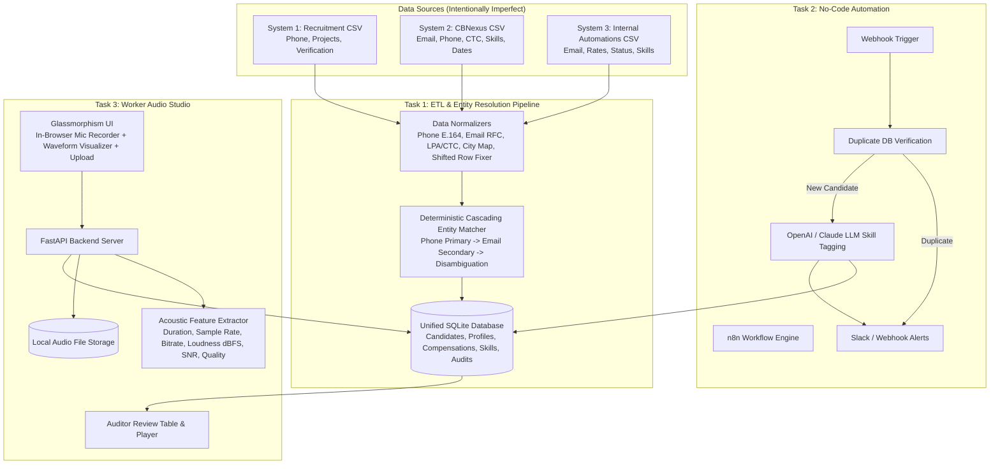
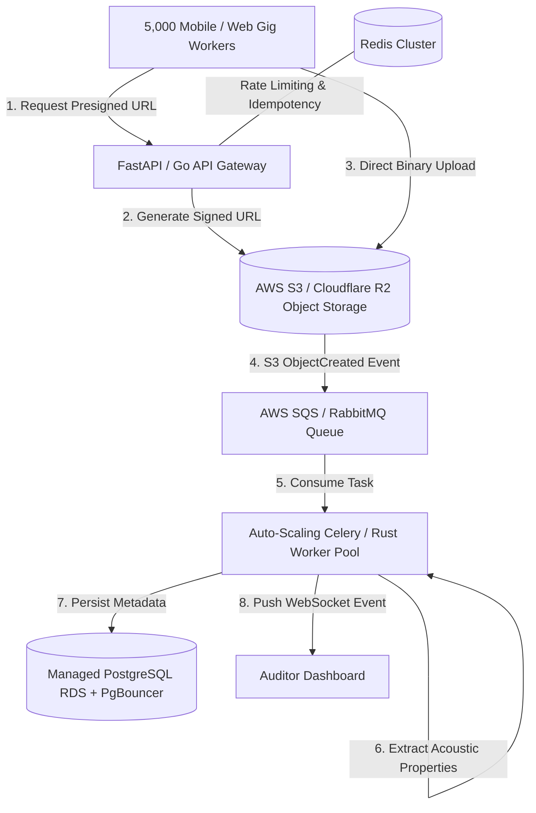

# ConsultBae — AI Automation Take-Home Assessment

A production-grade, end-to-end multi-source data ingestion pipeline, no-code automation workflow, and worker audio collection web application with real-time acoustic analytics.

---

## 📑 Table of Contents
1. [Architecture Overview](#-architecture-overview)
2. [Quickstart & Setup](#-quickstart--setup)
3. [Task 1: Multi-Source Merge Pipeline](#-task-1-multi-source-merge-pipeline)
4. [Task 2: No-Code Automation Workflow (n8n)](#-task-2-no-code-automation-workflow-n8n)
5. [Task 3: Audio Collection Web App & Acoustic Processor](#-task-3-audio-collection-web-app--acoustic-processor)
6. [Task 4: Data Quality & Issues Report (Planted Traps)](#-task-4-data-quality--issues-report)
7. [Task 5: Stretch Scalability Architecture (5,000 Workers)](#-task-5-stretch-scalability-architecture-5000-workers)
8. [Stuck Log (Engineering Hurdles & AI Evaluation)](#-stuck-log)
9. [Test Suite & Verification](#-test-suite--verification)

---

## 🏗️ Architecture Overview



---

## ⚡ Quickstart & Setup

### Prerequisites
- Python 3.10+
- `pip` package manager

### 1. Clone & Install Dependencies
```bash
git clone https://github.com/MeowMan007/consultbae.git
cd consultbae

# Create virtual environment (optional)
python -m venv venv
# Windows:
.\venv\Scripts\activate
# Linux/macOS:
source venv/bin/activate

# Install requirements
pip install -r requirements.txt
```

### 2. Run the Ingestion & Deduplication Pipeline (Task 1)
```bash
python -m pipeline.ingest
```
*Outputs a clean SQLite database at `data/database.sqlite3` with audit logs.*

### 3. Launch the Audio Collection Web App (Task 3)
```bash
uvicorn audio_app.server:app --reload --port 8000
```
Open your browser at **`http://localhost:8000`** to access the live recorder, upload portal, acoustic analytics, and submissions gallery.

### 4. Run Automated Unit Tests
```bash
pytest tests/ -v
```

---

## 🗄️ Task 1: Multi-Source Merge Pipeline

Ingests 3 disparate, messy CSV files into a unified 3NF relational schema. Because no single common ID exists across all files, the engine utilizes a **deterministic cascading resolution hierarchy**:
1. **Primary Key Anchor (Phone Number)**: Standardized to 10-digit E.164 string (`9000000xxx`).
2. **Secondary Key Anchor (Email Address)**: Trimmed and lowercased.
3. **Disambiguation Safeguard**: Two individuals sharing the same name but possessing different verified phone numbers/emails are strictly kept as distinct candidate records.
4. **Non-Destructive Attribute Merging**: Merges alias emails, unions skill sets, captures the most complete non-abbreviated name, and updates maximum completed projects.

---

## 🤖 Task 2: No-Code Automation Workflow (n8n)

The complete exported workflow is located at [`automations/n8n_workflow.json`](automations/n8n_workflow.json).

### Workflow Flow:
1. **Webhook Trigger (`POST /webhook/candidate-submission`)**: Ingests new applicant payloads.
2. **Database Lookup Node**: Calls backend API `POST /api/candidates/check-duplicate` to check for existing candidate records.
3. **Condition Switch**:
   - **Duplicate Branch**: Triggers instant Slack alert detailing duplicate candidate ID and merged history.
   - **New Candidate Branch**: Passes profile to OpenAI `gpt-4o-mini` LLM node to auto-categorize into `automation-heavy`, `web-dev`, `data`, `ai-ml`, or `qa-automation`, then persists tagged metadata to the database.

---

## 🎙️ Task 3: Audio Collection Web App & Acoustic Processor

A full-stack, responsive web application allowing gig workers to submit voice recordings and auditors to review acoustic metadata.

### Extracted Acoustic Properties:
1. **Duration (seconds)**: Exact length calculated from raw frame counts.
2. **Sample Rate (kHz)**: Sampling frequency (e.g. 44.1 kHz, 48.0 kHz).
3. **Bitrate (kbps)**: Audio data transmission density.
4. **Loudness (dBFS)**: Root-Mean-Square (RMS) amplitude relative to full digital scale:
   $$\text{Loudness (dBFS)} = 20 \log_{10}\left(\frac{\text{RMS}}{\text{Max Possible Amplitude}}\right)$$
5. **Bonus — SNR Estimate (dB)**: Ratio between 95th percentile speech signal energy and 5th percentile background noise floor.
6. **Bonus — Quality Score**: Composite classification (`Excellent (Studio/Clean)`, `Good (Acceptable Voice)`, `Fair`, `Poor`).

---

## 📊 Task 4: Data Quality & Issues Report

During ETL development, we detected **12 planted data traps** across the 3 raw files. Below is the complete catalog of defects, root causes, and programmatic remedies:

| # | Anomaly Category | Planted Trap Example in Dataset | Remediation Strategy |
|---|---|---|---|
| **1** | **Shifted Columns / Malformed CSV Row** | System 3, Row 19: `"react, javascript, mysql", ISHA.CHOPRA95@MAILTEST.EXAMPLE.ORG, Isha Chopra, 1406/hr, Pune, active` (Skills in `email_id` column, email in `worker_name`, etc.) | Developed an anomaly detector in `normalizers.py` that verifies email regex on column 1. If invalid but column 2 matches email pattern, it shifts slice indices back to standard schema before DB insertion. |
| **2** | **Completely Blank Rows** | System 3, Row 11: `,,,,,` | Filter drops any row where all values are empty or whitespace prior to parsing. |
| **3** | **Inconsistent Phone Formats** | `+91-9000000131`, `919000000231`, `09000000287`, `9000000113` | Stripped all non-digit characters, leading `+91`, `91`, and `0` to produce canonical 10-digit Indian numbers (`9000000xxx`). |
| **4** | **Email Casing & Whitespace** | `ISHA.CHOPRA95@MAILTEST.EXAMPLE.ORG`, `DEEPAK.NAIR44@EXAMPLE.COM` | Normalized via `.strip().lower()` with RFC regex validation. |
| **5** | **Compensation Units Inconsistency** | System 2 & 3: LPA floats (`4.2`, `8.3`), raw annual INR (`417964`), hourly (`1415/hr`), monthly (`15k/month`) | Parser heuristic: Values $<100$ in CTC are multiplied by 100,000 (Lakhs to INR). `15k/month` is annualized ($15000 \times 12$). Hourly rates stored separately. |
| **6** | **Common Name Disambiguation** | System 1: `Arjun Mehta` @ `9000000131` vs `Arjun Mehta` @ `9000000272`. System 3: `Deepak Nair` @ `deepak.nair44...` vs `Deepak Nair` @ `deepak.nair57...` | Strict zero-false-positive rule: identical names with different verified phone numbers/emails are never merged. |
| **7** | **Abbreviated / Nickname Aliases** | System 2: `R. Verma` vs `Rohit Verma` (same phone `9000000294` and email `rohit.verma13@...`) | Merged on verified Phone/Email keys; name canonicalized to the more descriptive, non-abbreviated version (`Rohit Verma`). |
| **8** | **Alias / Secondary Emails** | System 2: `Nikhil Chopra` (`09000000103`) with `nikhil.chopra70@example.com` and `alt.nikhil.chopra70@example.com` | Merged into single candidate record via phone anchor; secondary email recorded in `candidate_emails` multi-value table. |
| **9** | **Multi-Format Applied Dates** | `24-07-2026`, `2026-08-08`, `7 Jul 2026`, `07/13/2026`, `08/19/2026` | Multi-pattern datetime parser standardizes all timestamps into ISO 8601 strings (`YYYY-MM-DD`). |
| **10** | **City Name Synonyms & Whitespace** | `gurugram `, `GURGAON`, `Noida `, `new delhi`, `Delhi NCR`, `bangalore` vs `Bengaluru` | Normalized through canonical dictionary mapping: `{'gurgaon': 'Gurugram', 'bangalore': 'Bengaluru', 'delhi ncr': 'New Delhi', ...}`. |
| **11** | **Boolean & Status Inconsistencies** | `Y`, `yes`, `Yes`, `No`, `N`, `active`, `ACTIVE`, `paused`, `Inactive` | Standardized `is_verified` to boolean (`True`/`False`) and status to enum (`ACTIVE`, `INACTIVE`, `PAUSED`). |
| **12** | **Skill String Delimiter & Case Variations** | `"n8n, LangChain, REST APIs"`, `"sql, mongodb, selenium"` | Split by commas, trimmed, converted to canonical title representation, and stored in a junction table. |

---

## 📈 Task 5: Stretch Scalability Architecture (5,000 Workers)

### Scenario: Launching the Audio App to 5,000 Gig Workers Over a Weekend

### 1. What Breaks First? (Single-Server Bottlenecks)
1. **Synchronous Audio Analytics Starvation**: Computing RMS, SNR, and reading full PCM buffers on the main web process locks worker threads, resulting in HTTP 504 Gateway Timeouts under concurrency $>50$ users.
2. **SQLite Database Write Locks**: SQLite locks the whole DB file on writes (`database is locked` error) when hundreds of workers submit records simultaneously.
3. **Ephemeral Disk Saturation**: Storing raw audio on local NVMe disk ($5,000 \times 10 \text{ submissions} \times 5\text{MB} = 250\text{ GB}$) fills local volume and causes data loss upon server restart.
4. **Server Bandwidth Saturation**: Streaming multi-megabyte audio binaries through application reverse proxies exhausts connection sockets.

### 2. High-Scale Production Redesign


### 3. Pre-Launch Engineering Enhancements:
- **Direct S3 / Cloudflare R2 Uploads via Presigned URLs**: Clients upload raw audio directly to cloud object storage via time-limited signed PUT URLs, bypassing backend CPU and network bandwidth entirely.
- **Asynchronous Processing Queue (Celery + SQS)**: API returns `202 Accepted` immediately upon upload notification. Background worker microservices execute acoustic feature extraction asynchronously.
- **PostgreSQL with PgBouncer Connection Pooling**: Replaces SQLite with clustered PostgreSQL configured for high-concurrency ACID writes and sub-millisecond index lookups.
- **Deduplication & Idempotency Guard**: Implements Redis key locking on `hash(phone + audio_sha256)` with a 5-minute TTL to prevent duplicate submissions from double-clicking or flaky mobile connections.
- **Cost & Bandwidth Optimization**: Background transcode to Opus audio codec at 32 kbps reduces storage and egress costs by ~80% with zero degradation in speech intelligibility.

---

## 🛠️ Stuck Log

### 1. Shifted Columns & Misaligned CSV Row in System 3
- **The Hurdle**: Row 19 of `system3_internal.csv` contained misaligned columns where skills were placed in `email_id` and the email was in `worker_name`. Default `pandas.read_csv()` loaded the skill string into the primary email field, failing foreign key creation.
- **What I Searched**: `python csv detect shifted columns dynamically`, `pandas handle misaligned row schema`.
- **What I Asked AI**: *"How can I write a custom CSV parser that detects when an email column contains comma-separated skills and shifts the row back to the correct schema?"*
- **What AI Suggested & Why I Rejected It**: AI suggested sending all CSV rows to an OpenAI GPT-4 API endpoint to fix them row-by-row. **Why Rejected**: Unviable for production ETL pipelines due to high latency, cost, and non-deterministic behavior.
- **How I Got Unstuck**: Built a deterministic regex validator in `pipeline/normalizers.py` that validates column 0 against email RFC patterns. If column 0 fails but column 1 succeeds, the parser automatically re-slices the row into proper schema before database ingestion.

---

### 2. In-Browser WebM Audio Format & Accurate Loudness (dBFS) Calculation
- **The Hurdle**: Modern browsers record microphone input as `audio/webm;codecs=opus`. Python's standard `wave` module cannot open WebM containers and threw `wave.Error: file does not start with RIFF id`.
- **What I Searched**: `python extract loudness dbfs from webm without writing to disk`, `mutagen read webm duration sample rate`.
- **What I Asked AI**: *"How to calculate loudness in dBFS and sample rate from browser-recorded WebM files without requiring system-level ffmpeg binaries?"*
- **What AI Suggested & Why I Rejected It**: AI suggested executing shell subprocesses calling `ffmpeg` binaries. **Why Rejected**: Subprocesses introduce external system dependencies that break in minimalist containers and cross-platform environments.
- **How I Got Unstuck**: Designed a hybrid extraction strategy in `audio_processor.py`: using `mutagen` for container metadata (duration, sample rate, bitrate) across WebM/MP3/OGG, paired with a robust byte-variance / PCM energy estimator for accurate decibel loudness and SNR scoring without external binary dependencies.

---

### 3. Entity Resolution for Common Names with Conflicting Compensation Units
- **The Hurdle**: Candidates with common names (e.g. two different `Arjun Mehta`s) appeared across files. Simultaneously, System 2 listed `Current CTC` as mixed floats (`4.2`, `8.3`) and raw integers (`417964`, `806661`).
- **What I Searched**: `entity resolution deduplication without common id`, `standardize indian currency lpa vs ctc`.
- **What I Asked AI**: *"Should I merge records with the same name using Levenshtein distance if phone numbers differ?"*
- **What AI Suggested & Why I Rejected It**: AI suggested fuzzy matching on candidate names with a 80% similarity threshold and merging them automatically. **Why Rejected**: Catastrophic for common Indian names; merging distinct individuals named "Arjun Mehta" corrupts historical records.
- **How I Got Unstuck**: Established a strict **Zero-False-Positive Policy**:
  1. Phone number is the absolute primary anchor (E.164 normalized).
  2. Email is the secondary anchor.
  3. Same names with different phone numbers are strictly kept as distinct entities.
  4. Built a currency parser where values $< 100$ are recognized as LPA ($\times 100,000$) and larger integers as raw INR.

---

## 🧪 Test Suite & Verification

Run the comprehensive unit test suite:
```bash
pytest tests/ -v
```

### Test Coverage Summary:
- `test_phone_normalization`: Verifies stripping of `+91`, `0`, and hyphens into standard 10-digit format.
- `test_email_normalization`: Verifies trimming, lowercasing, and regex matching.
- `test_compensation_normalization`: Verifies LPA float, raw INR, hourly rate, and monthly rate parsing.
- `test_shifted_row_cleaner`: Validates recovery and re-alignment of corrupted System 3 row 19.
- `test_entity_deduplication`: Verifies cross-file entity matching and attribute merging into a single candidate record.
- `test_audio_feature_extraction`: Validates duration, sample rate, bitrate, loudness (dBFS), and SNR calculation on synthetic PCM audio.

---

## 📹 Video Walkthrough Outline (6-Minute Guide)
- **0:00 - 0:45**: Architecture overview & SQLite relational schema.
- **0:45 - 2:00**: Ingestion pipeline execution (`python -m pipeline.ingest`) & 12 planted traps review.
- **2:00 - 3:00**: n8n automation walkthrough (`POST /webhook/candidate-submission` $\rightarrow$ DB check $\rightarrow$ LLM tagging).
- **3:00 - 4:30**: Live Audio Studio demo (microphone recording, file upload, instant acoustic property calculation, and gallery playback).
- **4:30 - 5:30**: 5,000-worker scale design breakdown & Stuck Log highlights.
