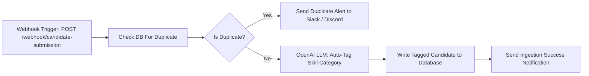

# Task 2: No-Code Automation Workflow (n8n)

This directory contains the production-ready no-code automation workflow for ConsultBae candidate ingestion, deduplication, LLM-powered skill auto-tagging, and alerting.

---

## 🚀 Workflow Overview



### Key Features:
1. **Webhook Trigger**: Listens for new candidate submissions or CSV row events via `POST /webhook/candidate-submission`.
2. **Database Verification**: Queries the ConsultBae backend API (`POST /api/candidates/check-duplicate`) using normalized phone and email to check for existing records.
3. **Branch 1 (Duplicate Alert)**: If duplicate found, sends a rich alert to Slack/Discord with previous candidate history.
4. **Branch 2 (LLM Skill Categorization)**: If new candidate, prompts OpenAI (`gpt-4o-mini`) to categorize candidate skills into:
   - `automation-heavy` (e.g. n8n, Zapier, Selenium, Web Scraping, LangChain)
   - `web-dev` (e.g. React, JavaScript, FastAPI, REST APIs)
   - `data` (e.g. Pandas, SQL, MySQL, MongoDB)
   - `ai-ml` (e.g. PyTorch, NLP, LangChain, LLMs)
   - `qa-automation`
5. **Database Persistence**: Writes the LLM-derived tags and confidence score back to the database.

---

## 🛠️ How to Import & Run in n8n

### Option 1: n8n Cloud / Desktop App
1. Open your n8n workspace.
2. In the top-right menu, select **Workflows** -> **Import from File**.
3. Select `n8n_workflow.json` from this folder.
4. Set up credentials:
   - OpenAI API key (for the LLM node)
   - Slack Webhook URL (for notification nodes)
5. Click **Save** and toggle the workflow to **Active**.

### Option 2: Local Docker Container
```bash
docker run -it --rm --name n8n -p 5678:5678 -v ~/.n8n:/home/node/.n8n n8nio/n8n
```

---

## 🧪 Testing the Workflow with cURL

### 1. Test New Candidate Submission:
```bash
curl -X POST http://localhost:5678/webhook/candidate-submission \
  -H "Content-Type: application/json" \
  -d '{
    "name": "Aditi Rao",
    "phone": "+91-9876543210",
    "email": "aditi.rao@example.com",
    "skills": "n8n, LangChain, Python, Zapier, REST APIs",
    "experience_years": 3.5,
    "projects_completed": 8
  }'
```

### 2. Test Duplicate Alert Trigger:
```bash
curl -X POST http://localhost:5678/webhook/candidate-submission \
  -H "Content-Type: application/json" \
  -d '{
    "name": "Rohit Nair",
    "phone": "9000000268",
    "email": "rohit.nair32@mailtest.example.org",
    "skills": "REST APIs, n8n, Web Scraping, Docker"
  }'
```
